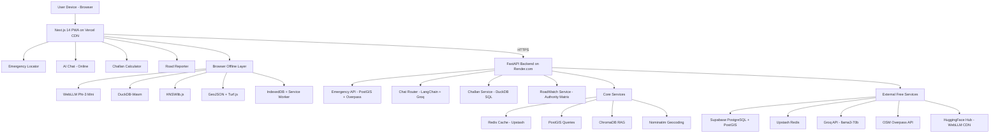
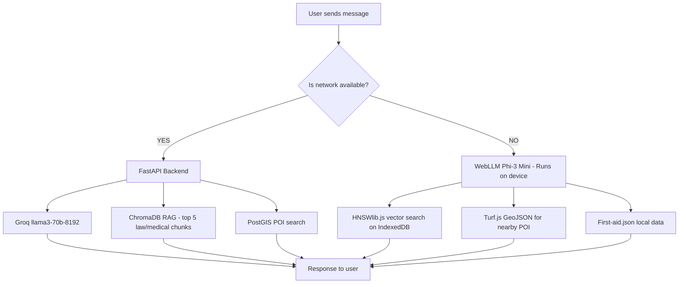
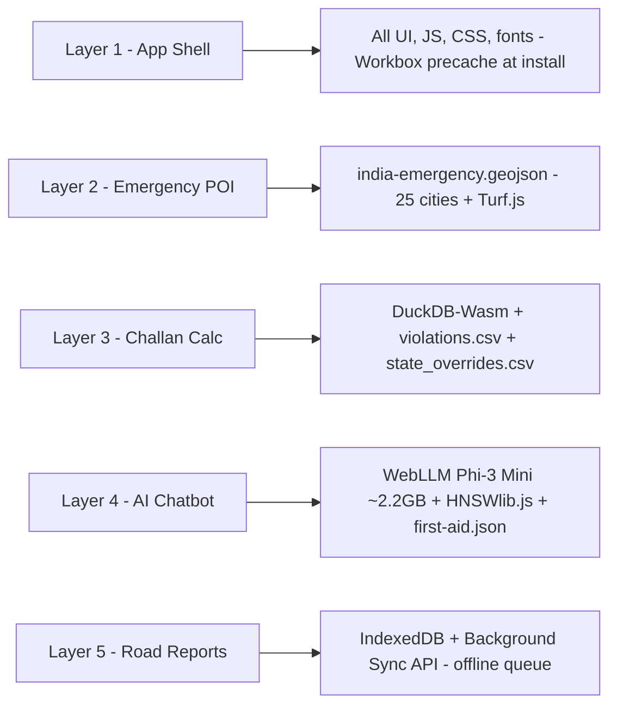
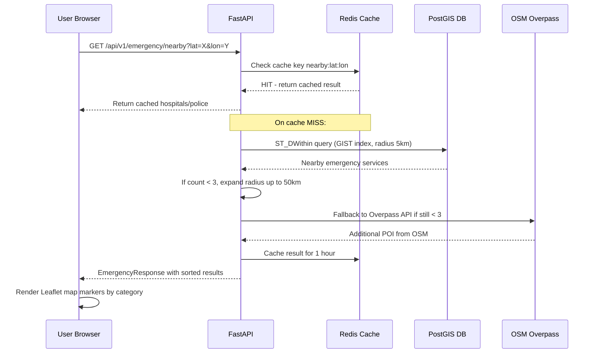
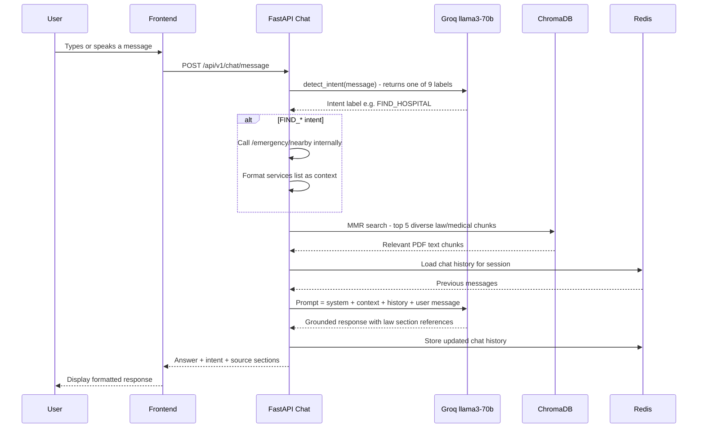

# SafeVisionAI - Architecture

## System Architecture Overview



---

## Dual-Layer AI Architecture

The most technically significant decision in SafeVisionAI. Online RAG with Groq when connected, full offline AI using WebLLM when not.



| Aspect | Online - Layer 1 | Offline - Layer 2 |
|---|---|---|
| LLM | Groq llama3-70b-8192 | WebLLM Phi-3-mini-4k (4-bit) |
| Parameters | 70 billion | 3.8 billion |
| Runs on | Groq cloud (free API) | User's browser (WebGPU) |
| Context | 8,192 tokens | 4,096 tokens |
| First token | 1-2 seconds | 3-5s (GPU) / 8-15s (CPU) |
| RAG | ChromaDB on server | HNSWlib.js in browser |
| POI Search | PostGIS ST_DWithin | Turf.js haversine on GeoJSON |
| Challan | DuckDB SQL on server | DuckDB-Wasm in browser |
| Cost | Rs. 0 (Groq free tier) | Rs. 0 (local device compute) |

---

## 5-Layer Offline Architecture



---

## Data Flow: Emergency Locator



---

## Data Flow: AI Chatbot



---

## RAG Pipeline Architecture

```mermaid
flowchart TD
    subgraph BUILD ["Phase 1 - Index Build (once, ~10 minutes)"]
        P1[PDF Documents] --> P2[PyPDFLoader]
        P2 --> P3[LangChain Documents with metadata]
        P3 --> P4["RecursiveCharacterTextSplitter - chunk 1000, overlap 150"]
        P4 --> P5["sentence-transformers/all-MiniLM-L6-v2 - 384-dim embeddings"]
        P5 --> P6[ChromaDB Storage - data/chroma_db/]
    end

    subgraph QUERY ["Phase 2 - Query Handling (every message)"]
        Q1[User message] --> Q2[all-MiniLM embedding - 384-dim vector]
        Q2 --> Q3["ChromaDB MMR search - balance relevance + diversity"]
        Q3 --> Q4[Top 5 law/medical chunks]
        Q4 --> Q5["Inject into Groq prompt as context"]
        Q5 --> Q6[Groq llama3-70b grounded response]
    end
```



---

## PWA Caching Strategy

| Resource Type | Strategy | Cache Name | TTL |
|---|---|---|---|
| App shell (HTML/JS/CSS) | Precache | app-shell | versioned |
| /api/v1/emergency/* | NetworkFirst | emergency-api | 3600s |
| *.geojson files | CacheFirst | geojson-data | permanent |
| *.onnx / *.bin / *.wasm | CacheFirst | model-weights | permanent |
| OSM tile URLs | StaleWhileRevalidate | osm-tiles | 500 entries max |
| /api/v1/challan/* | NetworkFirst | challan-api | 86400s |
| Road issue photos | Background Sync | IndexedDB queue | - |
| /offline-data/*.json | CacheFirst | offline-content | permanent |

---

## Monorepo Folder Structure

```
SafeVisionAI/
  backend/           FastAPI Python 3.11 application
  frontend/          Next.js 14 TypeScript PWA
  docs/              Technical documentation
  .github/
    workflows/
      ci.yml         GitHub Actions CI/CD
  render.yaml        Render.com deployment config
  .gitignore
  README.md
  SETUP.md
```

---

*Document version: 1.0 | IIT Madras Road Safety Hackathon 2026*
