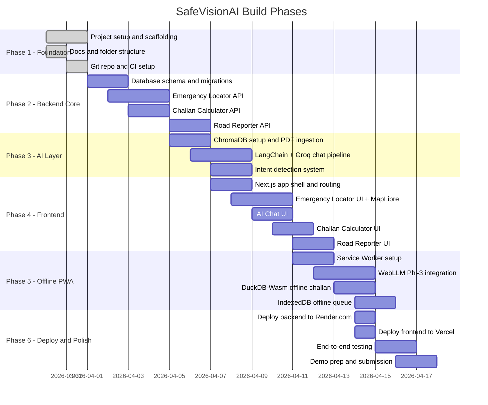

# SafeVisionAI - Roadmap

Build phases for the IIT Madras Road Safety Hackathon 2026 submission.

---

## Phase Overview

---

## Phase 1 - Foundation (Done)

**Goal:** Project structure, documentation, Git setup.

- [x] Create monorepo structure (backend/, frontend/, docs/)
- [x] Write all documentation (Agent.md, PRD, Architecture, API, DB, etc.)
- [x] requirements.txt and package.json with pinned versions
- [x] .gitignore, README.md, SETUP.md
- [x] GitHub repo created and initial push done
- [x] CI/CD workflow stub (.github/workflows/ci.yml)

---

## Phase 2 - Backend Core

**Goal:** All 4 API modules working with real data.

- [x] Set up Supabase project and enable PostGIS + pg_trgm
- [x] Run Alembic migrations (create all 6 tables)
- [x] Seed traffic violations data (seed_violations.py)
- [x] Seed emergency services for 25 cities from OSM (seed_emergency.py)
- [x] Emergency Locator API - ST_DWithin + Overpass fallback
- [x] Geocoding API - Nominatim reverse geocode
- [x] Challan Calculator API - DuckDB SQL + state overrides
- [x] Road Reporter API - submit issue, route to authority
- [x] Set up Upstash Redis and connect cache client
- [x] Write tests for all endpoints (pytest)

**Key files:**
- `backend/api/v1/emergency.py`
- `backend/api/v1/challan.py`
- `backend/api/v1/roadwatch.py`
- `backend/services/overpass_service.py`
- `backend/services/challan_service.py`
- `backend/services/authority_router.py`

---

## Phase 3 - AI Layer

**Goal:** RAG chatbot working online with Groq + ChromaDB.

- [x] Download 3 PDFs (MV Act 1988, MV Amendment 2019, WHO Trauma)
- [x] Run build_vectorstore.py to index PDFs into ChromaDB
- [x] LangChain RAG chain with ChromaDB MMR retrieval
- [x] Groq llama-3.3-70b-versatile integration
- [x] Intent detection system (9 intent labels)
- [x] Chat history in Redis per session
- [x] Chat API endpoint - POST /api/v1/chat/message
- [x] Test RAG accuracy on sample queries

**Key files:**
- `backend/services/llm_service.py`
- `backend/api/v1/chat.py`
- `backend/data/build_vectorstore.py`

---

## Phase 4 - Frontend

**Goal:** All 4 modules working as connected UI.

- [x] Next.js App Router setup with TypeScript
- [x] Tailwind CSS global styles and design tokens
- [x] Home page with 4 module cards
- [x] Emergency Locator - GPS + MapLibre GL map + hospital markers
- [x] SOS button - calls nearest hospital
- [x] AI Chat - message bubbles, intent badges, source citations
- [x] Challan Calculator - violation selector, state dropdown, fine display
- [x] Road Reporter - photo upload, GPS tag, category select, submit
- [x] First Aid page - static offline guide
- [x] Zustand global store (location, chat history, offline status)
- [x] SWR data fetching with error/loading states

**Key files:**
- `frontend/app/emergency/page.tsx`
- `frontend/app/chat/page.tsx`
- `frontend/app/challan/page.tsx`
- `frontend/app/report/page.tsx`
- `frontend/components/EmergencyMap.tsx`
- `frontend/components/ChatInterface.tsx`
- `frontend/lib/store.ts`

---

## Phase 5 - Offline PWA

**Goal:** All core features work with no internet connection.

- [x] Service worker + Workbox configuration
- [x] Precache app shell (HTML, JS, CSS, fonts)
- [x] Cache india-emergency.geojson at install time
- [x] DuckDB-Wasm + violations.csv for offline challan
- [x] WebLLM Phi-3 Mini one-time download and browser inference
- [x] HNSWlib.js vector search on first-aid.json
- [x] IndexedDB offline queue for road reports
- [x] Background Sync API for auto-submit when online
- [x] Offline status indicator in UI
- [/] Test all 4 modules in Chrome DevTools offline mode

**Key files:**
- `frontend/lib/edge-ai.ts`
- `frontend/lib/duckdb-challan.ts`
- `frontend/lib/offline-store.ts`
- `frontend/public/offline-data/`

---

## Phase 6 - Deploy and Polish

**Goal:** Live demo URLs working, submission ready.

- [ ] Deploy FastAPI to Render.com (render.yaml)
- [ ] Set all backend env vars in Render dashboard
- [ ] Deploy Next.js to Vercel
- [ ] Set all frontend env vars in Vercel dashboard
- [ ] Test full E2E flow on live URLs
- [ ] Test offline mode on mobile (Chrome + Firefox)
- [ ] Test on low-end Android device
- [ ] Lighthouse audit - target PWA score > 90
- [ ] Record demo video
- [ ] Final submission

---

## Status Legend

| Symbol | Meaning |
|---|---|
| [x] | Done |
| [ ] | Not started |
| [/] | In progress |
| [-] | Skipped / deferred |

---

*Last updated: March 31, 2026*
